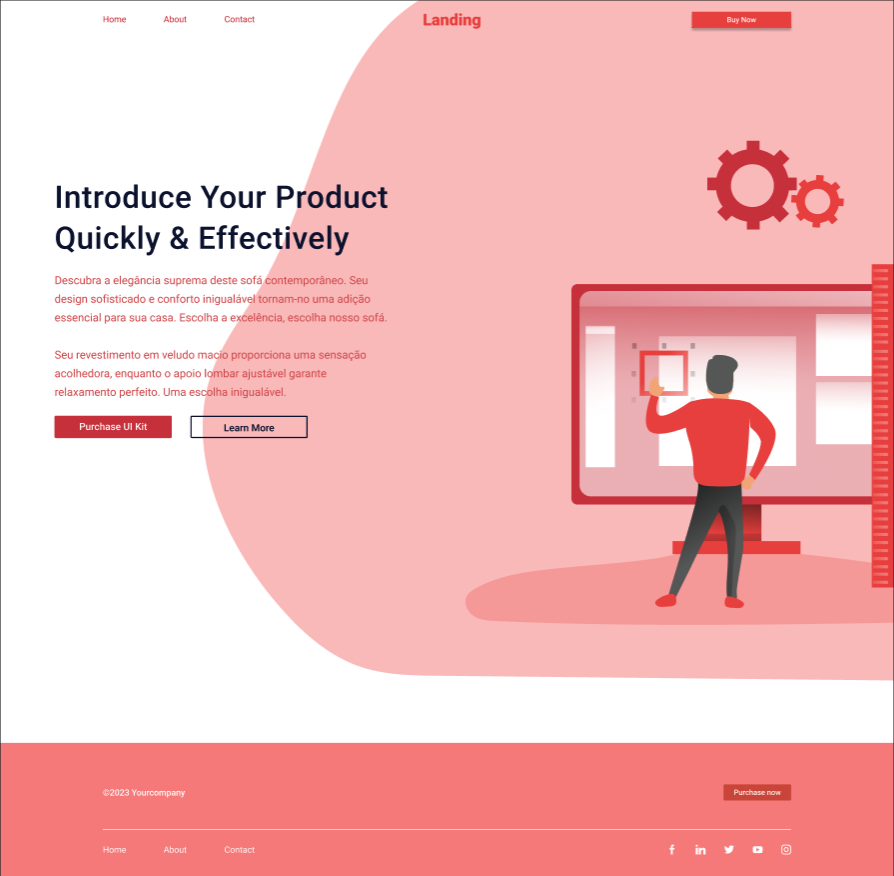

# G5-DinamicaAda-1095
Repositório destinado a dinâmica em grupo da Formação de Front end da Ada Tech. Onde foi trabalhada tanto hard skills quanto principalmente as soft skills para tornar o HTML da página semântico e resolver desconformidades do CSS em comparação com o layout desejado do Figma.

##Tecnologias usadas:
- HTML
- CSS

